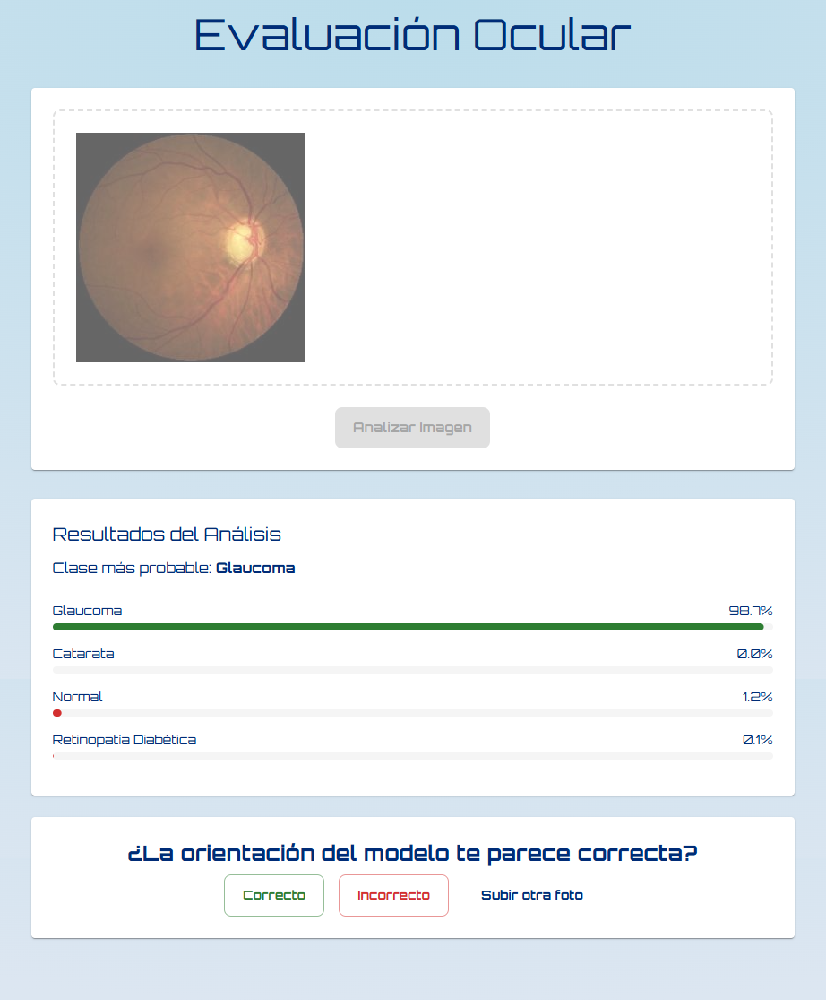
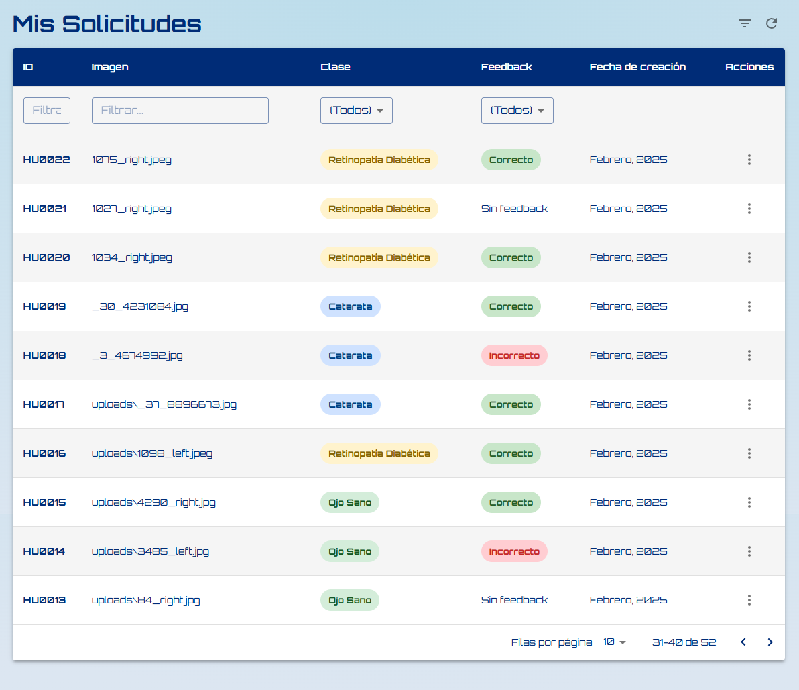
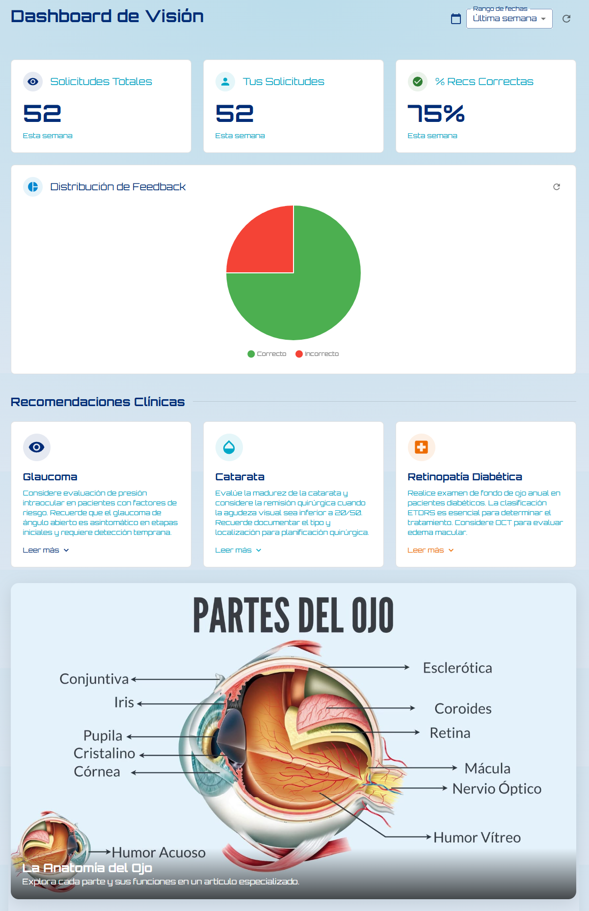

# **OcuPredict - Sistema de Diagnóstico Ocular (Front-End)**

Este repositorio contiene la implementación del **front-end** de **OcuPredict**, un sistema de diagnóstico ocular diseñado para médicos. La aplicación es una **Single Page Application (SPA)** desarrollada en **React** con **Vite**, la cual consume los endpoints del back-end para permitir:

- **Inicio de sesión y registro** mediante JWT, con verificación por código enviado por correo.
- **Carga y análisis de imágenes oculares** mediante un modelo de PyTorch (.pth) alojado de forma segura en AWS S3.
- **Visualización de resultados** de predicción con probabilidades y sugerencias diagnósticas.
- **Feedback del médico** para confirmar o refutar la recomendación del modelo.
- **Historial de solicitudes** con posibilidad de descargar imágenes y revisar diagnósticos anteriores.
- **Dashboard de métricas** con estadísticas y gráficos personalizados (solicitudes totales, porcentaje de recomendaciones correctas, etc.).

---

## **Características del Front-End**

- **Autenticación y Registro:**  
  Inicio de sesión y registro con verificación vía correo.
  
- **Evaluación Ocular:**  
  Interfaz para subir imágenes oculares, recibir el diagnóstico predictivo y enviar feedback al modelo.

- **Historial de Solicitudes:**  
  Visualización de las solicitudes realizadas, con detalles de cada diagnóstico y la posibilidad de descargar la imagen.

- **Dashboard de Métricas:**  
  Panel de control que muestra estadísticas generales y del usuario, incluyendo gráficos interactivos.

- **Responsive y Moderno:**  
  La interfaz utiliza **Material UI** para un diseño moderno, responsivo e intuitivo.

- **Integración con Back-End:**  
  Se consumen los endpoints del back-end para realizar las operaciones CRUD y el procesamiento del modelo.

---

## **Requisitos Previos**

- **Node.js:**  
  [Descargar Node.js](https://nodejs.org/) (versión LTS recomendada).

- **Yarn:**  
  Instalado globalmente:
  ```bash
  npm install --global yarn
  ```

- **Git:**  
  Para clonar el repositorio.

---

## **Configuración Inicial**

1. **Clonar el repositorio:**
   ```bash
   git clone https://github.com/Danielrp551/sistema_ocu_predict.git
   cd sistema_ocu_predict
   ```

2. **Instalar dependencias:**
   ```bash
   yarn install
   ```

3. **Configurar Variables de Entorno:**
   - El proyecto incluye un archivo `.env.development` para el entorno de desarrollo. Ejemplo:
     ```env
     VITE_API_URL=http://localhost:5000
     ```
   - Crea un archivo `.env.production` para producción y configúralo localmente (no se incluye en el repositorio).

---

## **Ejecución en Desarrollo**

1. Inicia la aplicación en modo desarrollo:
   ```bash
   yarn dev
   ```
2. La aplicación estará disponible en `http://localhost:5173` (o el puerto que indique la consola).

---

## **Construcción para Producción**

1. Genera los archivos estáticos optimizados:
   ```bash
   yarn build
   ```
2. Los archivos generados estarán en la carpeta `dist/`.

3. Para probar la build localmente:
   ```bash
   yarn preview
   ```
   Esto levantará un servidor local para visualizar la aplicación optimizada.

---

## **Despliegue**

### **Despliegue en Vercel / Netlify**
El despliegue en producción se realizó utilizando plataformas como **Vercel** o **Netlify**.

Pasos para desplegar:
1. Realiza un fork del repositorio.
2. Inicia sesión en la plataforma (Vercel o Netlify) y selecciona la opción para importar tu proyecto desde GitHub.
3. Configura las variables de entorno, especialmente `VITE_API_URL`, que debe apuntar al back-end de producción.
4. Selecciona la rama principal (`main` o `master`) para el despliegue.
5. Inicia el despliegue.
6. Una vez completado, recibirás una URL pública para acceder a la aplicación.

---

## **Capturas de Pantalla**

### **Inicio de Sesión**


### **Evaluación Ocular**


### **Historial de Solicitudes**


### **Dashboard de Métricas**


---

## **Notas Adicionales**

- La URL del back-end se configura en el archivo `.env.development` mediante la variable `VITE_API_URL`.
- En producción, asegúrate de configurar adecuadamente las variables de entorno para conectar con el back-end y otros servicios.
- El front-end está diseñado para ser altamente modular y escalable, permitiendo actualizaciones y mejoras continuas.

---
